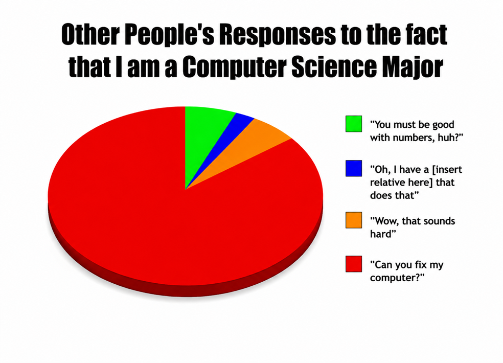

<h1 align="center">Hi 👋, I'm Thinh Nguyen</h1>

<h3 align="center">
Computer Science Student • Full Stack Developer • AI & Cloud Enthusiast
</h3>

  

  

  
  
  

  

## 👨‍💻 About Me

- 🎓 Computer Science student at **Ho Chi Minh University of Technology (HCMUT)**
- 💻 Interested in **Full Stack Development, Cloud Computing, AI, and Game Dev**
- 🌱 Currently learning **AWS, System Design, and Machine Learning**
- 🚀 Passionate about building practical software that solves real problems
- ⚡ Enjoy chess, game development, and exploring new technologies.

## 🛠 Tech Stack

  

